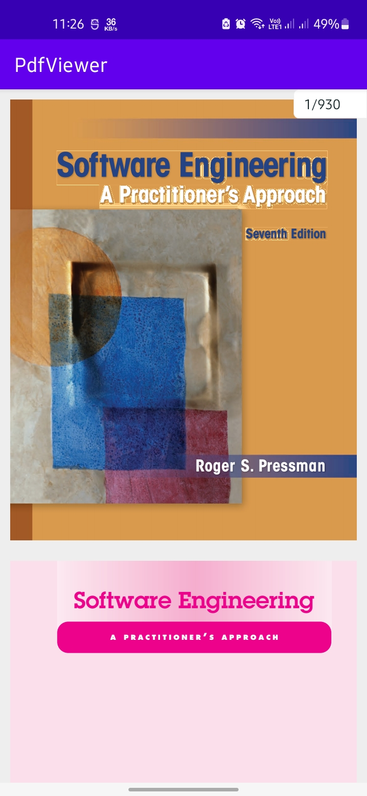
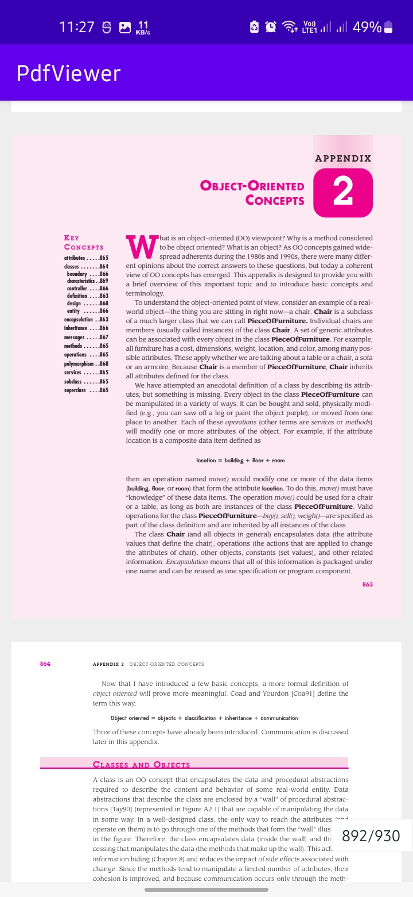

# ACPdfView
A simple light weight and smooth PDF View for Android. Written in Java.

## Screenshots

 <pre>
     
</pre>

## Implementation
Step 1. Add the JitPack repository to your build file

Add it in your root build.gradle at the end of repositories:
```
allprojects {
    repositories {
        ...
	maven { url 'https://jitpack.io' }
    }
}
```

Step 2. Add the dependency
```
dependencies {
    implementation 'com.github.Bhuvaneshw:acpdfview:v1.1.1'
}
```
Latest Version.<br/>
[](https://jitpack.io/#Bhuvaneshw/acpdfview)

Step 3. Declare View in xml
```
<?xml version="1.0" encoding="utf-8"?>
<RelativeLayout xmlns:android="http://schemas.android.com/apk/res/android"
    android:layout_width="match_parent"
    android:layout_height="match_parent"
    android:background="#eeeeee">

        <com.acutecoder.pdf.PdfView
            android:id="@+id/pdfView"
            android:layout_width="match_parent"
            android:layout_height="match_parent" />

        <ProgressBar
            android:layout_width="wrap_content"
            android:layout_height="wrap_content"
            android:id="@+id/pg"
            android:layout_centerInParent="true"/>

        <com.acutecoder.pdf.PdfScrollBar
            android:id="@+id/pdfScroll"
            android:layout_width="match_parent"
            android:layout_height="match_parent"/>

</RelativeLayout>
```

Step 4. Load in Activity
```
public class MainActivity extends AppCompatActivity {

    @Override
    protected void onCreate(Bundle savedInstanceState) {
        super.onCreate(savedInstanceState);
        setContentView(R.layout.activity_main);

        PdfView pdfView = findViewById(R.id.pdfView);
        PdfScrollBar scrollBar = findViewById(R.id.pdfScroll);
        ProgressBar progressBar = findViewById(R.id.pg);

        scrollBar.attachTo(pdfView);
        pdfView.setZoomEnabled(true);
        pdfView.setMaxZoomScale(3);
        pdfView.setPath(new File(getFilesDir() + "/pdf.pdf"));
        pdfView.addOnActionListener(new OnActionListener() {
            @Override
            public void onLoaded() {
                progressBar.setVisibility(View.GONE);
            }
        });
        pdfView.load();
    }
}
```

## License
~~~
                     GNU GENERAL PUBLIC LICENSE
                       Version 3, 29 June 2007

 Copyright (C) 2007 Free Software Foundation, Inc. <https://fsf.org/>
 Everyone is permitted to copy and distribute verbatim copies
 of this license document, but changing it is not allowed.

    ACPdfView  Copyright (C) 2023  Bhuvaneshwaran
    This program comes with ABSOLUTELY NO WARRANTY;
    This is free software, and you are welcome to redistribute it
    under certain conditions;

  The GNU General Public License does not permit incorporating your program
into proprietary programs.  If your program is a subroutine library, you
may consider it more useful to permit linking proprietary applications with
the library.  If this is what you want to do, use the GNU Lesser General
Public License instead of this License.  But first, please read
<https://www.gnu.org/licenses/why-not-lgpl.html>. 
~~~
